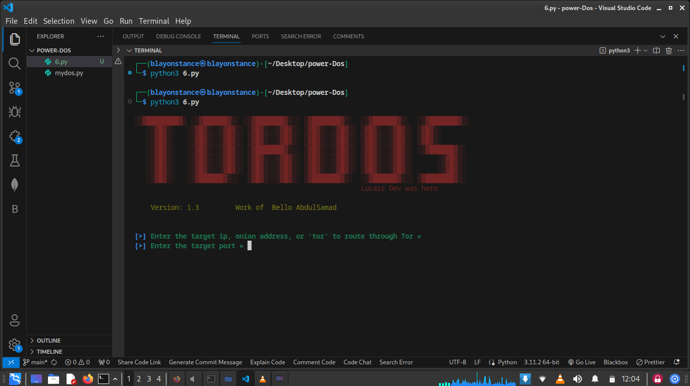

# Tor Dos

TorDoS is a Python script designed for conducting Denial of Service (DoS) attacks over the Tor network. It provides a convenient way to perform DoS attacks on both regular IP addresses and Onion services. Utilizing the Tor network adds an extra layer of anonymity to the attacker, making it more challenging to trace back the source of the attack.

# Features :
- Ability to target both IP addresses and Onion services.
- Utilizes the Tor network for routing, enhancing anonymity.
- Multi-threaded design for concurrent attacks.
- Customizable packet size and thread count for flexibility.
- Informative console output with status updates and error handling.
 
# Usage :
- Clone the repository.
- Install the required dependencies, including TorPy, using pip install -r requirements.txt.
- Run the script and follow the prompts to specify the target type (IP, Onion, or Tor), target address, port, packet size, and thread count.

# Note: 
This script is for educational and research purposes only. Misuse of this tool for illegal activities is strictly prohibited.

 # Contributions:
Contributions and suggestions for improvements are welcome. Please open an issue or submit a pull request with your proposed changes.

# Author:
Bello AbdulSamad 

## Screenshots

